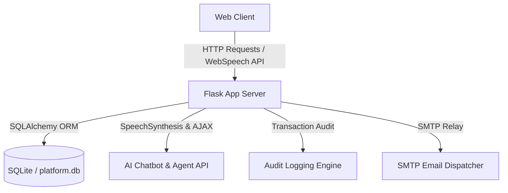

# Deployment & Operations Guide

This guide describes how to run and deploy the **StreamVibe AI-Powered Movie and Music Platform** in local development, testing, and production environments.

## 1. Quick Start (Local Run)

The application is self-contained and pre-seeded with sample database entries (movies, songs, albums, ads, and active promotions).

### Prerequisites
* Python 3.11 or higher
* `pip` package manager

### Steps
1. Install the required Python packages:
   ```bash
   pip install -r requirements.txt
   ```
2. Run the application:
   ```bash
   python app.py
   ```
3. Open your browser and navigate to:
   * Portal: [http://localhost:5000](http://localhost:5000)
   * Setup Database (to force clear/reseed): [http://localhost:5000/dev/setup](http://localhost:5000/dev/setup)

---

## 2. Default Accounts & Testing Logins

To test the role-based access control, use these pre-seeded logins:

| Username | Role | Password | Description |
| :--- | :--- | :--- | :--- |
| **admin** | Super Admin | `admin123` | Full access to portal branding, SEO, logs, users, movies, payments. |
| **demo** | User | `demo123` | Standard customer account. Can stream music, purchase movies, check logs. |

---

## 3. Docker Deployment

For standardized container environments:

1. Build and start the container using Docker Compose:
   ```bash
   docker-compose up -build -d
   ```
2. The service will spin up on [http://localhost:5000](http://localhost:5000).

---

## 4. Platform Architectural Overview



### Components
* **Flask App Backend (`app.py`)**: Entry point handling routing, core business APIs, role authentication, and mock dispatch.
* **SQLAlchemy Database Models**: Handles platform data structures including movies, songs, coupons, ads, and logs.
* **Secure Token Delivery**: Checks 24h expiration and count limits (max 3 downloads per link).
* **AI Recommendation Engine**: Filters movies by price limits, genre keywords, and languages.
